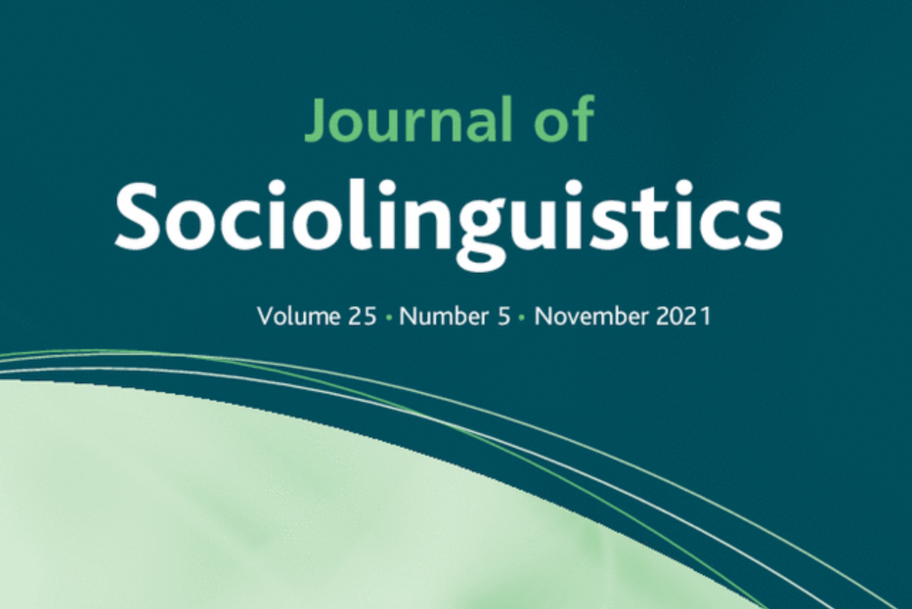

layout: true

<div class="my-footer"><span class="highlight-front">slides:&emsp;<a href="https://bit.ly/hinrichs-hh-slides">bit.ly/hinrichs-hh-slides</a>&emsp;|&emsp;web:&emsp;<a href="https://larshinrichs.site">larshinrichs.site</a></span></div> 

---
class: middle

```{r setup, include=FALSE}
options(htmltools.dir.version = FALSE)
knitr::opts_chunk$set(
  fig.width=9, fig.height=3.5, fig.retina=3,
  out.width = "100%",
  cache = FALSE,
  echo = TRUE,
  message = FALSE, 
  warning = FALSE,
  hiline = TRUE
)
```

```{r xaringan-tile-view, echo=FALSE}
xaringanExtra::use_tile_view()
```

```{r xaringan-themer, include=FALSE, warning=FALSE}
library(xaringanthemer)
style_mono_light(base_color = "#23395b",
  inverse_header_color = "#FFFFFF",
  title_slide_background_image = "hands_icon.png",
  header_font_google = google_font("Josefin Sans", "600"),
  text_font_google   = google_font("Josefin Sans", "300", "300i"),
  code_font_google   = google_font("Fira Mono"),
  text_font_size = '1.9em',
  code_font_size = '0.7em'
)
```

```{r xaringanExtra, echo=FALSE}
xaringanExtra::use_xaringan_extra(c("tile_view", "animate_css", "tachyons"))
```


## Outline

1. Diaspora Sociolinguistics
1. Variation & Change in Texas English
1. Digital Text Analysis

---
class: inverse, center, middle

# Diaspora Sociolinguistics


---
class: center, middle

### Some programmatic publications

<hr />

Blommaert (2003; 2010)

Johnstone (2016)

Pennycook (2011)

<hr />

---
class: center

### But also 




---
background-image: url("jsoc_intro.png")
background-size: cover

---
class: middle

.f4.lh-copy.mid-grey.bg-light-yellow.b--dark-green.ba.bw2.br3.shadow-5.ph4.mt2[
The global turn in anthropology [...] brought the initially marginal and challenging realities of globalisation, migration, and, transnationalism to the forefront of anthropological research. Sociolinguistics has also seen the beginnings of a **shift away from a default sedentarist analytic frame,** which tended to see migration as messy and intractable for large-scale analysis (NORMs—non-mobile, older, rural, males—in early dialectology, and a focus on sedentary groups for the apparent time construct in the variationist approach), towards an increasing **acceptance of mobile analytic orientations**
.tr[
— Sharma (in Tseng & Hinrichs, eds., 2021)
]]

---
